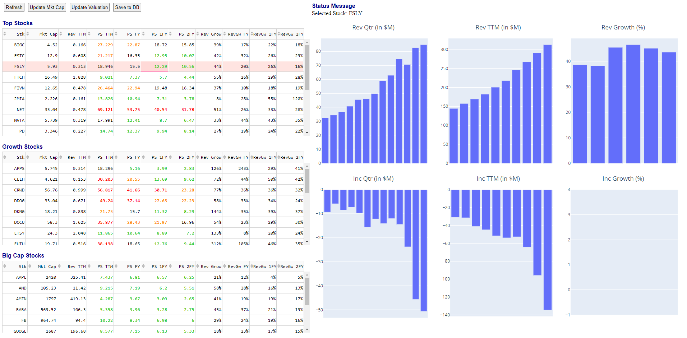

# ValDashboard

Dash application to scrape the web for fundamentals data on certain predetermined stocks.
A live demo of the page can be accessed [here](https://val-dash.neilchristanto.com).
While it can be accessed from a mobile device, the live page is not optimized for it.

## Why I created this ##

I like coding. I like the stock market. There are numerous websites that can tell valuations and historical data
for **one company** at a time. But for me personally, I want to be able to look at valuations (that I care about) for
**different companies** at the same time so that I can compare them. The other thing I want see is 
**multiple historical financial performance** (in charts) at the same time for a particular company.

Given those two things, I set out to code something that scrapes the publicly available data that I need from 
two different websites and display it in a relatively simple format: collection of tables and charts.

## Valuation Tables

Currently arranged as 3 tables: top growth stocks, other growth stocks, and big cap stocks. 
Each table displays the following valuation metrics:

* Market Cap
* Revenue TTM (Trailing Twelve Month)
* P/S (Price to Sales ratio), with the sales being TTM revenue
* P/S for the current, next, and next two fiscal year 
* Revenue growth for the current, next, and next two fiscal year

### Table Sorting

The entries in the table can be sorted according to the headers.
So the user can sort by either the stock ticker symbol, or any of the valuation metrics
(i.e. to find which stock has the cheapest valuation, or the best projected revenue growth)

### Entry Colors

The P/S ratio is colored based on the following rule:

1. **Green** (P/S < 15)  
   This is very attractive for the most part, especially with more than 30% projected growth.
   While the stock is considered cheap, it could be cheap for a not very desirable reason
   (e.g. very low projected growth).
   

2. **Orange** (20 < P/S < 30)  
   With the P/S in this range, it's getting into the expensive side. It could still be a good buying opportunity
   if the projected growth is strong (e.g. maybe more than 40%)

 
3. **Red** (P/S > 30)  
   This is an expensive stock valuation-wise. Usually a stock becomes this expensive because it has shown 
   massive growth rate, or the projected growth rate is still very high (well above 50%). At this point, 
   usually the good things are priced in already (hence the expensive valuation) and the downside is larger 
   than the upside. Doesn't mean it will not continue going higher though.

## Financial History Charts

There are 5 charts to show the historical data of the following metrics, shown per quarter:

* Revenue for that quarter
* TTM revenue
* TTM revenue growth
* Net income for that quarter
* TTM net income

**Note:** The "Income Growth" is not implemented as of right now due to most growth stocks having negative net income.
In addition, the net income can vary wildly depending on the strategy employed at the time to fuel revenue growth,
so the income growth can fluctuate between positive and negative or even all over the place.

### Chart Features ###

The charts are built with Python `plotly` library so there are some nice functions that come with it:

* Hover to see the X-axis value (date) and Y-axis value (metric)
* Select area of the chart and zoom into it

## Disclaimer ##
I am not a certified financial planner or advisor. I built this dashboard as a hobby project 
out of my own interest in coding and the stock market.
This dashboard has been a useful tool for me to identify possibly undervalued stocks,
but as any other investment tools, this cannot guarantee future performance whatsoever.

NOTHING IN THE DASHBOARD REPRESENTS ANY RECOMMENDATION TO BUY OR SELL ANY SECURITIES.
